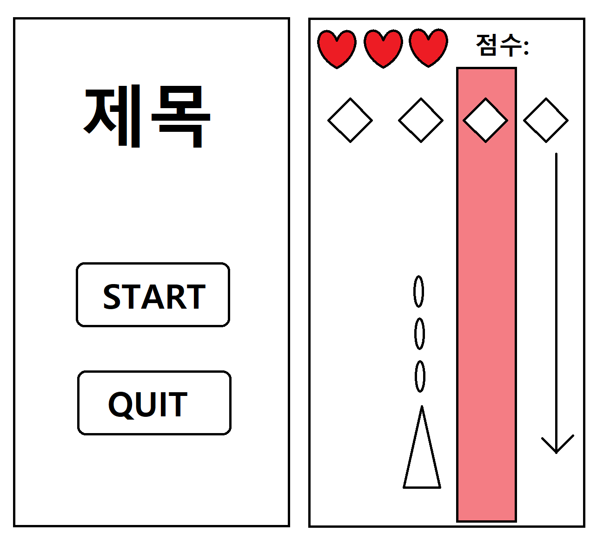

# 드래곤 플라이트

## - 게임 이미지

## - UI

- [ ] 초기화면에 시작 종료버튼

- [ ] 게임이 종료되면 점수확인 및 게임 종료 또는 다시하기창

  

## - 배경화면

- [ ] 천천히 아래로 계속 이동

## - 몬스터

- [ ] 한줄에 4마리씩 일정속도로 내려옴

- [ ] 죽을때 동전을 떨어트림
- [ ] 시간이 지날수록 점점 강해짐

## - 운석

- [ ] 파괴불가능한 무작위로 운석이 빠른속도로 떨어짐

- [ ] 운석이 떨어지기전에 떨어지는 위치에 경고 표시

## - 점수

- [ ] 플레이 시간에 비례해 점수 증가
- [ ] 동전을 먹으면 점수 증가

## - 캐릭터

- [ ] 패닝으로 좌우이동 가능 -> 이동속도는 패닝하는속도와 동일
- [ ] 따로 조작없이 계속 공격함
- [ ] 몬스터에 3번 피격시 사망
- [ ] 운석에 피격시 사망
- [ ] 죽으면 게임 종료 또는 다시하기 가능

# - 개발일정

1주차

- 기본 베이스 제작
  - 몬스터
  - 플레이어
  - 점수
  - 운석
  - 기본 UI

2주차
- 몬스터 구현
  - 한줄에 4마리씩 떨어짐
  - 시간이 지날수록 체력이 많아짐

3주차
- 운석 구현
  - 운석이 떨어지기 전에 경고 표시
  - 운석은 파괴불가

4, 5주차
- 캐릭터 구현
  - 패닝으로 좌우 이동
  - 이동속도는 손가락이 움직이는 속도
  - 계속 탄막 발사
  - 몬스터에 3번 피격 또는 운석에 충돌시 사망
  - 죽으면 게임 종료 또는 다시하기 창

6주차
- 동전 및 점수관련 구현
  - 몬스터 사망시 동전 드랍
  - 동전을 먹으면 점수 증가
  - 플레이한 시간에 비례해 점수 증가

7, 8주차
- 배경화면 구현
  - 일정한 이미지가 계속 아래로 이동
- 리소스 구하기 및 적용
  - 리소스를 구하기 전에는 임시이미지 사용

9주차

- 테스트 및 디버깅
